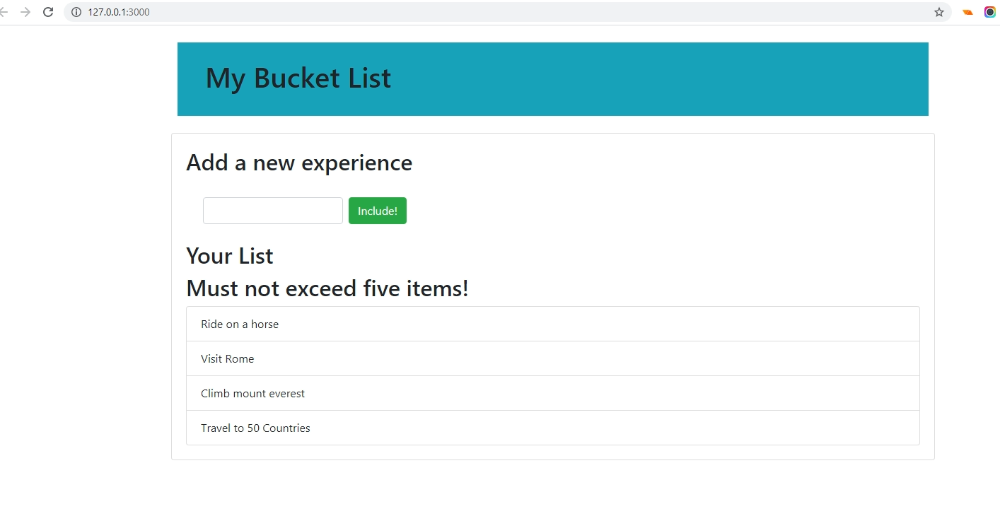

***
## MY BUCKET LIST APP

This project is used to explain the DOM, the `document` object, the various properties/methods as well as demonstrate how the various attributes can be used to manipulate the web page from JavaScript as well as get information about the web elements.

This project was styled using [Bootstrap](https://getbootstrap.com/).

You can read the complete DOM API tutorial [here](https://ubahthebuilder.tech/the-ultimate-tutorial-on-javascript-dom-js-dom-with-examples).
